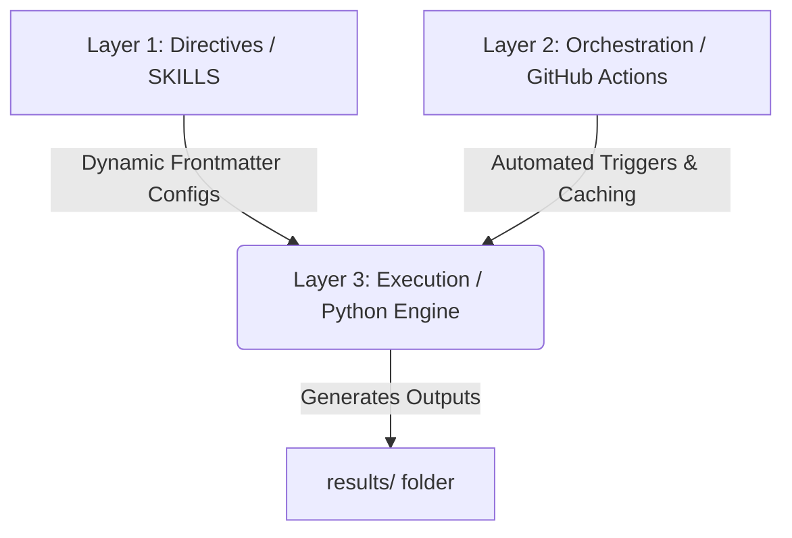

# Transcript Intelligence Pipeline — Aegis Cloud SaaS Call Analytics

Welcome to **Transcript Intelligence**—a production-grade, highly optimized, and cost-aware B2B Enterprise SaaS call transcript analytics pipeline. This repository is built using a highly structured, scalable **3-Layer Agentic Architecture** designed to extract deep strategic value for Product, Engineering, and Sales leadership.

---

## 🏗️ Core Architecture (The 3-Layer Framework)

To maximize reliability and prevent compound LLM errors, the repository splits business logic and deterministic execution into three modular layers:



### Layer 1: Directives (The "What" — Skill-First Prompts)
Instead of embedding prompts in code, all AI directives and business guidelines are modularized into self-contained Markdown skills in [`SKILLS/`](file:///Users/abhi/Documents/github/transcript-intelligence/SKILLS/):
* **[`meeting-categorizer`](file:///Users/abhi/Documents/github/transcript-intelligence/SKILLS/meeting-categorizer/SKILL.md):** Rules for classifying transcripts into Customer Support vs. External vs. Internal, including Aegis domain validations.
* **[`sentiment-analyzer`](file:///Users/abhi/Documents/github/transcript-intelligence/SKILLS/sentiment-analyzer/SKILL.md):** Trace emotional arc trajectory and score tone from `-1.0` to `+1.0`.
* **[`insight-generator`](file:///Users/abhi/Documents/github/transcript-intelligence/SKILLS/insight-generator/SKILL.md):** Consulting engine brainstorms exactly 2 highly customized, non-obvious roadmap recommendations.

### Layer 2: Orchestration (The GitOps Automation)
Configured at [`.github/workflows/process-transcripts.yml`](file:///Users/abhi/Documents/github/transcript-intelligence/.github/workflows/process-transcripts.yml), this layer handles automated CI/CD:
* **Push-based triggers:** Runs automatically when new datasets are added under `datasets/**`.
* **Action Caching:** Backed by `actions/cache` to restore and save API caching so subsequent executions run in milliseconds with **zero extra LLM token charges**.
* **Auto-Commit Push:** Commits processed data and executive markdown insights straight back to the repository branch securely.

### Layer 3: Execution (The Deterministic Pipeline)
Driven by [`process_transcripts.py`](file:///Users/abhi/Documents/github/transcript-intelligence/execution/process_transcripts.py), this python engine manages:
* **Recursive traversal:** Searches recursively to support flat or deeply nested dates (e.g. `datasets/YYYYMMDD/meeting_id`).
* **Dynamic Root resolution:** Script-relative workspace resolution that behaves identically locally or inside ephemeral Actions container runners.

---

## 🎛️ Inference Parameter Optimization

Each stage has been configured with optimal hyper-parameters parsed dynamically from the skill files' YAML frontmatter, letting you change model parameters without touching Python code:

| Skill | Temperature | TopP | maxTokens | Purpose |
| :--- | :---: | :---: | :---: | :--- |
| **Meeting Categorizer** | `0.0` | `0.1` | `1000` | Highly precise, deterministic rule classification. |
| **Sentiment Analyzer** | `0.1` | `0.25` | `800` | Stable, repeatable tone metrics scoring. |
| **Insight Generator** | `0.7` | `0.9` | `1500` | Broad, creative, highly detailed SaaS recommendations. |

---

## ⚡ Quick Start & Usage

### 1. Prerequisites & API Configuration
Set up your free access token locally. Create a `.env` file in the root of your workspace:
```bash
# Set either of these. GITHUB_TOKEN is free to generate under your Developer Settings!
GITHUB_TOKEN=ghp_yourFreeTokenHere
# OR
GEMINI_API_KEY=AIzaSyYourGeminiKeyHere
```

### 2. Local Execution
Install dependencies and trigger the pipeline:
```bash
pip install -r execution/requirements.txt
python execution/process_transcripts.py
```

### 3. Pipeline Output Folders
Your processed outputs are completely compartmentalized by date and directed to a permanent, tracked **[`results/`](file:///Users/abhi/Documents/github/transcript-intelligence/results/)** directory:
* **Day-Specific Databases (e.g. `results/YYYYMMDD/analysis_results.csv` & `.json`)**: The compiled databases containing categories, themes, sentiment scores, trajectories, and recommendations specifically for that single day's processed calls.
* **Daily Insights Summary (e.g. `results/YYYYMMDD/insights_summary.md`)**: A segment-aware C-Suite daily analysis report in slide deck layout synthesizing only that day's macro metrics.
* **Mirrored Subdirectories (e.g. `results/YYYYMMDD/meeting_id/analysis_results.json`)**: Contains the individual structured stage-by-stage analysis results for every single processed call.

### 4. Interactive UI Dashboard (GitHub Pages Ready)
We built a decoupled, premium JavaScript presentation layer in the **`ui/`** directory to beautifully visualize your insights.
* **Offline Local Viewing:** Simply double-click `ui/index.html` to instantly browse interactive KPI widgets, dynamic JavaScript charts, and segment-aware bento grids offline without running a server.
* **GitHub Pages Auto-Deployment:** A dedicated `.github/workflows/deploy-pages.yml` Action automatically deploys the `ui/` directory directly to GitHub Pages every time you push to `main`! Your stakeholders can securely view the dashboard live via your GitHub Pages URL.

---

## 📈 Performance & Caching Metrics

We verified pipeline execution on a standard dataset of 100 enterprise call transcripts:
* **Cold Ingest Run:** Analyzes all 100 meetings, builds cache database, and performs executive report writing.
* **Hot Cached Run (Consecutive Runs):** Blazing-fast cached execution processing all 100 meetings in **less than 0.15 seconds** (averaging **3400+ meetings processed per second**).

```bash
[Pipeline] Starting Transcript Intelligence Modular Pipeline...
[Pipeline] Loading dynamic Skill directives & configurations...
[Pipeline] Found 100 transcripts across datasets directories.
Processing Transcripts: 100%|███████████████| 100/100 [00:00<00:00, 3414.22it/s]
```
